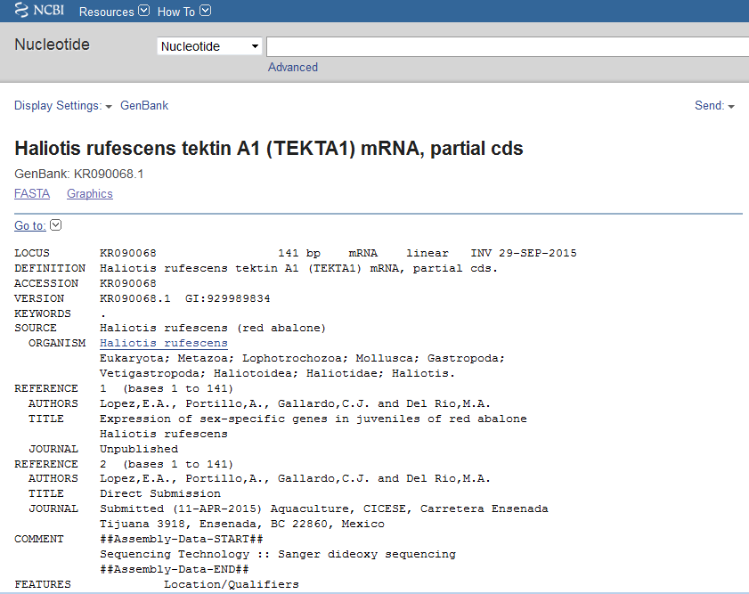

#Maturation and Spawning induction Genes. 
M. A. del Rio.

## Introduction
Two of the biggest problems in a genetic breeding program are the induction to maturation and to spawn. Most of the organisms do not mature under culture condition. If mature adults are found, many are induce to spawn. But not all organisms actually spawn. So the geneticist have to work with the organisms that spawn at the same time, so there is no a proper planning in crosses. 
Regulating genes (hormones?) that could induce maturation and spawning could help to geneticist to have a better plan for crossing in a genetic breeding program. 

It has been found that in the red abalone, some sex related genes start their expression in organisms as small as 15-25 mm SL (Lopez-Landavery et al. submitted). Thus, if a gene or genes are found to be related with maturation induction or spawning could help
It seems that in *Haliotis asinina*, the APGWamide prepropeptide mRNA (York et al., unplublished, ACCESSION   JN606061) is related with ovulation and spawning.
 

This gene is related to a Cerebral peptide from *Aplysia californica* (blasts E=7e-38), a APGW-amide-related neuropeptide from *Mytilus edulis* (blastx E=8e-21) 

An experiment trying to solve whether this or other genes are involved in maturation and spawning would be of great help in abalone breeding programs. So the objective of this work is to find mRNA sequences related with maturation and spawning in the red abalone.  

##Experimental design.
Collect tissue from ganglia (head) and digestive glad/gonads from different degrees of maturation, from juveniles (15 mmm SL) to adult organism (80 mm SL).

Induce other organisms to spawn and collect samples from the same tissues and carry out a RNA-seq. With the results compare the tissues from organisms that spawned and those which did not.

Compare transcriptomes and carry out experiments for induction 

  

##References
Lopez,E.A., Portillo,A., Gallardo,C.J. and Del Rio,M.A. (submmited) Expression of sex-specific genes in juveniles of red abalone Haliotis rufescens
York,P.S., Cummins,S.F., Degnan,S.M., Woodcroft,B.J. and Degnan,B.M. (Unpublished) Neuropeptide expression levels correlate with ovulation and spawning in *Haliotis asinina*. http://www.ncbi.nlm.nih.gov/nuccore/393713349

This is the fasta file from GenbBank with the sequence from *H. assinina*
>gi|393713349|gb|JN606061.1| Haliotis asinina APGWamide prepropeptide mRNA, complete cds
GATCCCTCCCTCTCCAGTGGGGCTTTTTCTTTAAAACCACGATGTCTTCTTTCATAAATTCGCTCACACT
GGGAGTTGTTGTGGTTTTAAGTGTCCTCAGTTGTAGTTTGGGAGAAGATCAAGTTGCCAGTGTAACGGGT
GACAAAGAAAAATCGGACTTTTCTCAAAGGACACTTGACTCTGTACATGTTTTGAAAAAAAGGGCCCCAG
GCTGGGGCAAGCGGTCGCTGGATGAGGATGTAGACAGTGACGACGATATGTCTTATGACAGTGAGTCCCC
AGAGGACATTTTATCAGGTGCTGATCTTTCCAAACGCGCGCCCGGTTGGGGCAAGCGTACCTTAGATATT
CTAGAAGATTACACCAAACGAGCACCCGGCTGGGGTAAGAGGGACTCTCTAGATGTTAAACGTGCACCTG
GATGGGGAAAACGCGATATCGATATGGACAAACGTGCACCTGGATGGGGCAAACGCGCACCTGGGTGGGG
CAAACGTGCACCTGGCTGGGGAAAACGGGCACCTGGCTGGGGAAAGCGTGCACCTGGTTGGGGCAAAAGA
GCACCTGGATGGGGCAAACGCTCTGACACATCATGTGCTGGAATCGACGAGGAGGTTGACTATTACATAT